# Git & GitHub Advanced Assignment

This repository demonstrates practical implementation of Git version control concepts including branching strategies, merge conflict resolution, stashing, cherry-picking, and history cleanup using squash.

---

## 📌 Project Objectives

- Create a Git repository
- Use feature branches
- Commit properly with meaningful messages
- Handle merge conflicts
- Use Git stash
- Push changes to GitHub

---

## Task 1 :- Create a Repository  

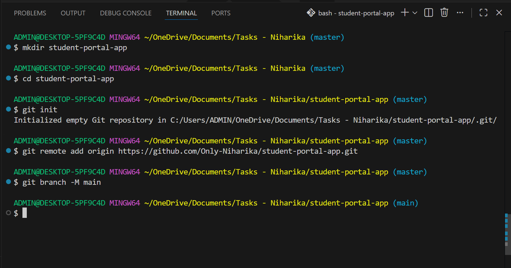

---

## Task 2 :- Use Feature Branches  

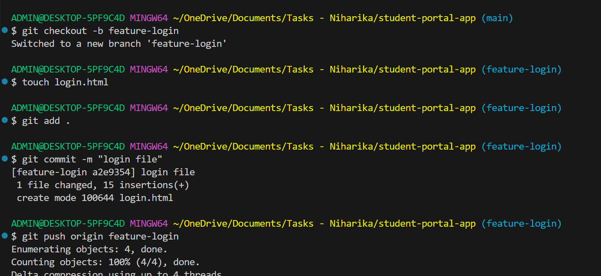
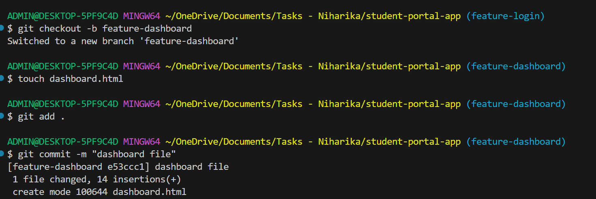
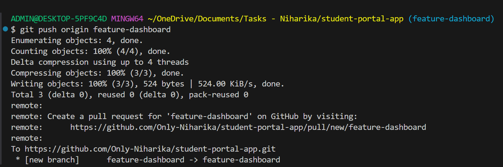

---

## Task 3 :- Proper Commit Messages  

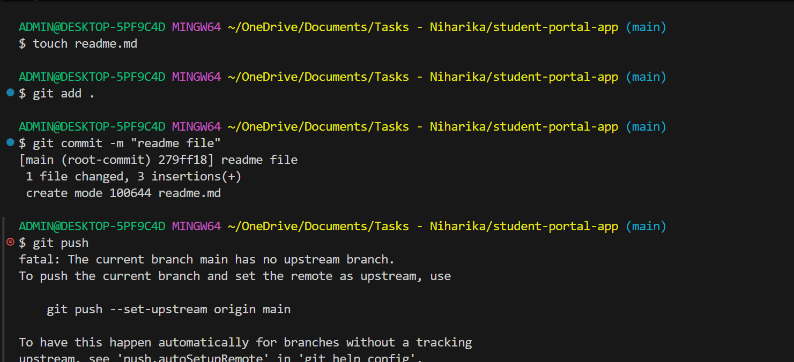
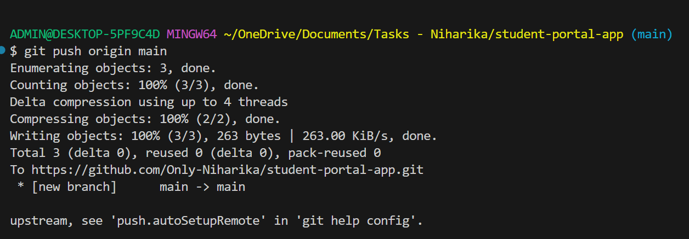

---

## Task 4 :- Handle a Merge Conflict  

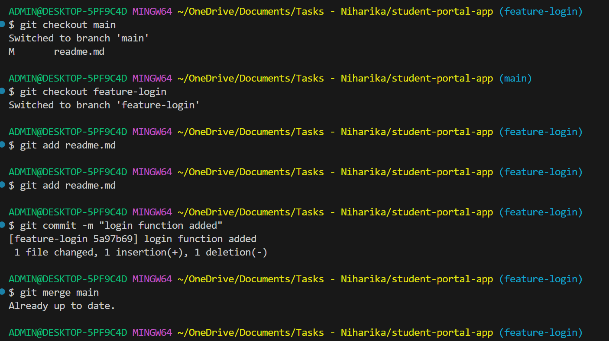
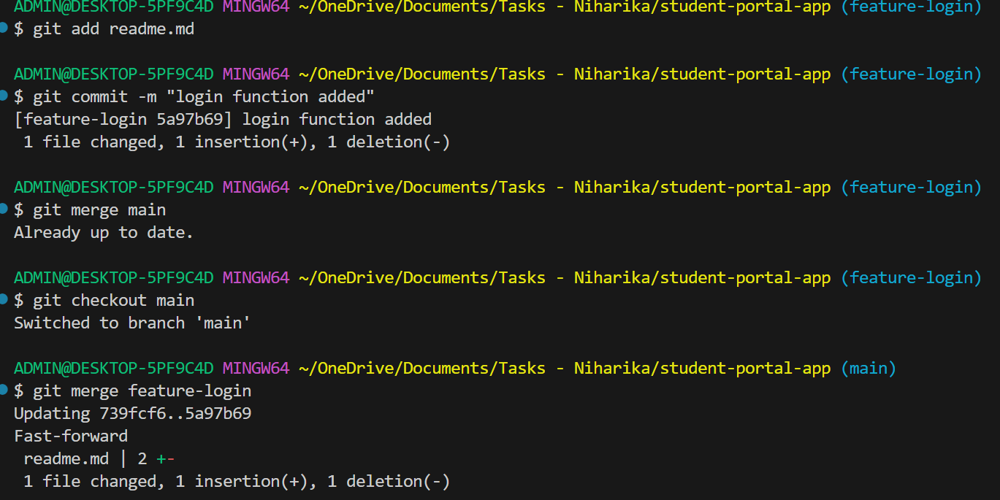

---

## Task 5 :- Use Git Stash  

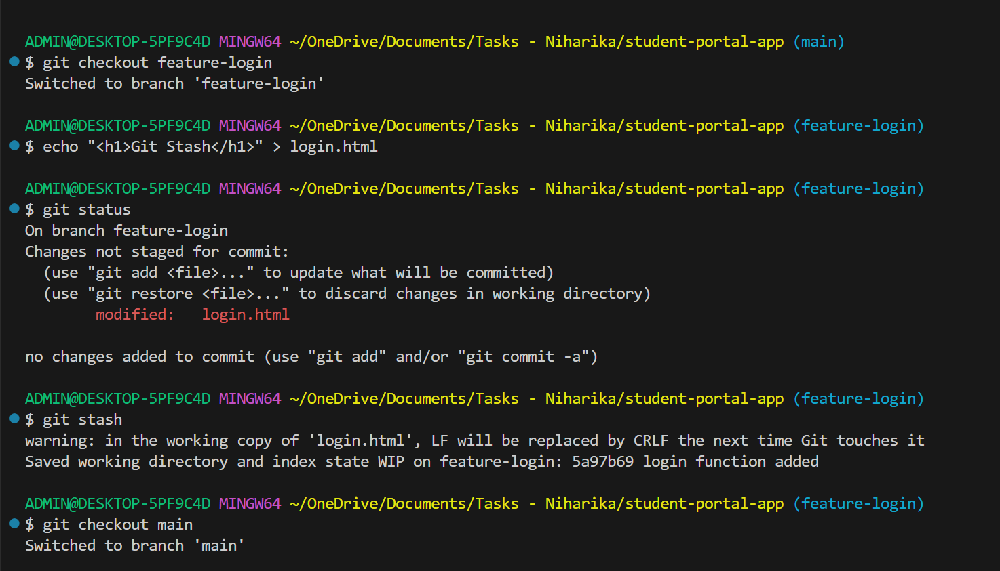
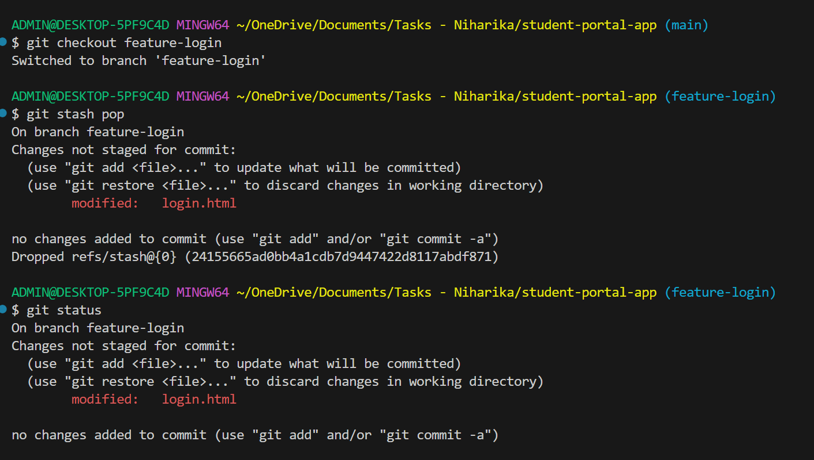
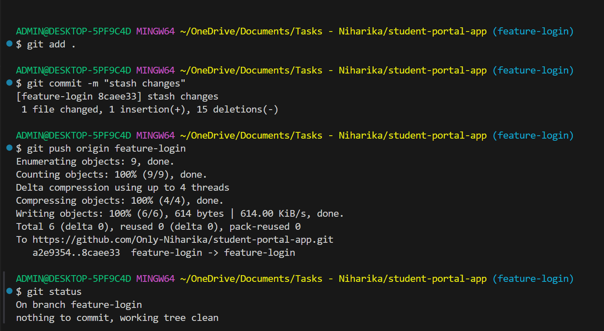

---

## 🛠 Technologies Used

- Git
- GitHub
- Linux / Git Bash
- VS Code (optional)

---
